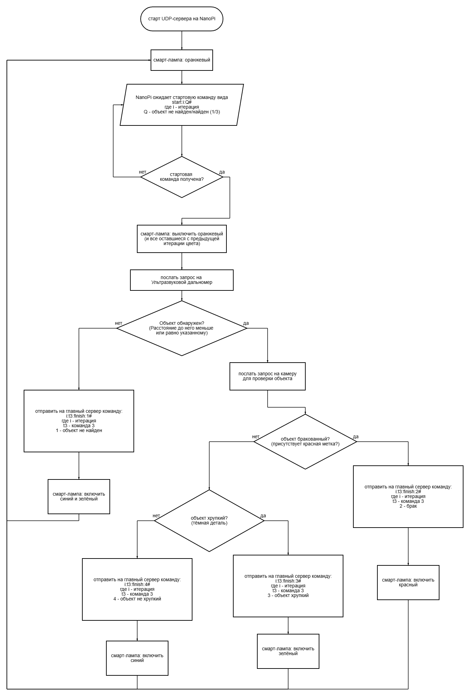

# РобоПром 2025

## Команда №3 | Старшая категория

### Задача

Выявление бракованных/хрупких/не хрупких деталей

***

### Состав команды

- Белов Максим
- Быкова Мария
- Епифанов Никита
- [Майоров Дмитрий](https://github.com/ghamlet)
- [Петров Павел](https://github.com/blackkkmaster)
- Павлушин Кирилл

***

### Блок-схема работы

## Демонстрация полигона Кванториума с развернутой производственной линией в завершающей стадии соревнований

